# Where Did This `<div>` Come From? — live-coding run-sheet

> Master script for the Clojure/conj 2026 talk, restructured around a LIVE BUILD
> (supersedes the slides+demo draft in `where-did-this-div-come-from.md`).
> Format: 40 minutes = 38 talk + 2 Q&A. Audience: Clojure-literate, knows Hiccup.
> We start from a basic hiccup webserver and build the whole inspector on stage,
> **without ClojureStorm** — this is the ch. 15 inspector only, no tracer.
>
> Companion demo repo: `conj/demo` (its own git repo, branches `step-0` … `step-7`).
> Every checkpoint boots and has been verified end-to-end, including the WS
> contract with a fake editor. The full code for every step is in
> `livecode-cheatsheet.md` (keep it on a second screen or printed) — for
> reference while you talk, and as a paste source if a checkout misbehaves.
> Nothing in it is typed on stage.
> Slides (49) are defined **in this file**, each as a
> `<!-- slide N · name -->` … `<!-- /slide -->` block after the page marker
> that first shows it; `slides.html` is generated from them (projector tab).
> They carry the code now — but still no plan slide and no step list until
> the end: the problem chain is the map.
> The architecture map (one diagram, drawn state by state on the map
> slides) is defined once, in *The map (diagram source)* at the end.

---

## The one design decision

**The slides carry the code; the editor and browser carry the proof.** Every
section runs the same three beats — a slide holding the handful of lines that
matter, a minute of narration over it, then `git switch -f step-N` and the
running app answers. Nothing is typed on stage:

- **SLIDE** only the code that carries the idea (`tr-load!`, the two
  attributes, the dispatch and the trust boundary, `instrument-var!`,
  `resolve-cursor`, the call-site rewrite). Fragments, not files — the full
  versions are in the cheatsheet, and the elisions are marked.
- **CHECKOUT** every step: `git switch -f step-N`. The watcher reloads in
  dependency order, the browser refreshes itself, and you land in exactly the
  state you rehearsed. Nothing you do on stage has to survive, so nothing can
  be lost — which is also why a derailment costs nothing.
- **REPL one-liners** only, and only twice: the value that knows its source
  (§4) and the seam that is `identity` in prod (§10).

**Recovery is a checkout.** The demo's own live-reload is the safety net: the
JVM stays up all talk, the watcher `tr-load!`s whatever changes on disk — so
`git switch -f step-N` instantly puts code AND browser in a known-good
state (verified: checkout → watcher reload → tags correct). If any section
derails: switch to its END branch, say "here's where we were going", demo the
payoff, continue. Nobody will mind; do not debug on stage for more than 30s.

| talk section | ends at git branch |
| --- | --- |
| §1 the problem + hot reload | `step-1` |
| §2 the question, asked twice | — |
| §3 why not? can we? (slides 19–20) | — |
| §4 keep the structure | `step-2` |
| §5 carry it to the DOM | `step-3` |
| §6 overlay + click→editor | `step-4` |
| §7 components | `step-5` |
| §8 reverse direction | `step-6` |
| §9 call sites | `step-7` |

---

## Stage setup (before doors)

1. VS Code open on `conj/demo` — or the workspace root, whose `.joyride`
   symlinks into it — **Calva jacked in** (`:dev` + `:nrepl` aliases, REPL
   cwd `demo/`), Joyride
   installed. (The editor-agent script only exists from `step-6` — it arrives
   with §8's checkout, and you run "Joyride: Run Workspace Script" then;
   nothing to connect at setup time.) Server started **from the REPL**:
   `(start!)` — the REPL lands in `user` (`dev/user.clj`) — same process as
   the REPL, that's what makes §10's sharp edge demoable.
2. Repo at `step-0`, working tree clean. Terminal tab ready with `git branch`
   listed. Browser on `https://myapp.lan` (the ingress; `localhost:8080`
   still works as a fallback), docked right; editor left.
   DevTools pre-docked (bottom), closed.
3. Font ≥ 20pt everywhere (editor, REPL, terminal, browser zoom 125%+),
   **DevTools zoomed ~150% too** (Ctrl-+ inside the pane — it does not follow
   browser zoom; §1's naked span and §5's `data-src` money shot are DevTools
   text). For the overlay demos (§6–§9) bump **browser zoom to 150%** — the
   breadcrumb is 13px CSS and scales with page zoom. Notifications off,
   network off (nothing needs it — deps are in `~/.m2`).
   **VS Code auto-save OFF** — with it on, the watcher live-loads every
   half-typed form and sprays `reload FAILED` all talk. Toggle the inspector
   with the badge click, not Alt+Shift+I, unless you've verified the
   shortcut on the stage browser/OS (it collides with browser chrome on
   some platforms).
4. Cheatsheet on second screen/printout. Slides in a browser tab (`slides.html`).
5. Fallback: the 60–90s recorded clip of the finished thing on a hotkey
   (record it during rehearsal at `step-7`). And a **live plan B for the
   Joyride agent** — the one failure a checkout can't fix: drive the reverse
   direction from the REPL,
   `(#'dev.editor/handle-cursor! {:file "demo/ui/views.clj" :line 23 :col 5})`
   (verified working) — it even reinforces the point that the editor side
   is just a socket message.
6. localStorage: turn the inspector badge OFF before starting (it persists!),
   so the first toggle on stage actually turns it on.

---

## §1 · The problem, and the chain that closes it (0:00–10:21) — slides 1–15

> The first three minutes are the abstract coming true in front of them —
> same arc, same key phrases ("the div forgets it was ever Clojure code on a
> line", "grep and guesswork"). The whole talk then runs on one engine,
> re-run in every section: *why don't we have this? can we have it? how?*
> The talk's real message — build what you can imagine; the status quo is a
> choice — is NEVER spoken. The form carries it: a "framework feature" built
> from a bare webserver in half an hour. Don't editorialize; demonstrate.

<!-- page "The connection that stops at the page" @0:00 [slide 1]
  slide 1
-->

<!-- slide 1 · title -->
# ++Where Did This `<div>` Come From?++

## Patrick de Kruif · Clojure/Conj 2026

<!-- /slide -->

**[SLIDE 1: title]** "Hello. My name is Patrick. I’m a freelance software developer and consultant from the Netherlands, and a lot of my work is building web applications in Clojure."

<!-- page "The recipe app" @0:12
  slide 2
-->

<!-- slide 2 · the app -->
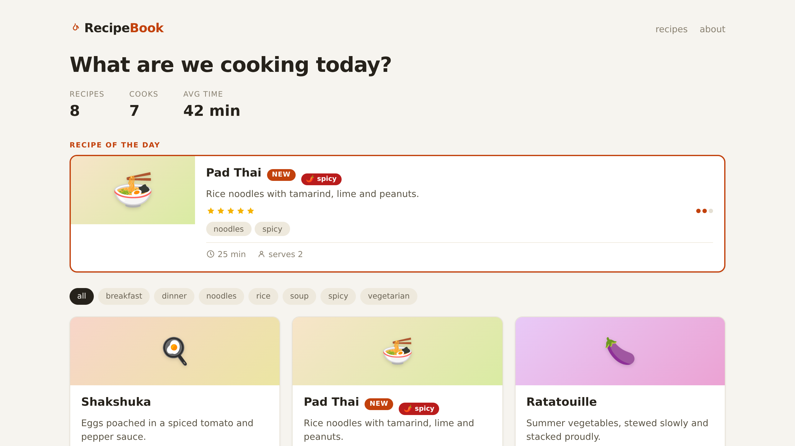
<!-- /slide -->

> Slide 2 for the app; the live browser runs the finished app (⌖ badge bottom-left).

> Show demo application

"For years, my default stack for applications like this was Reagent and re-frame. It provided the kind of user experience we wanted from a single-page application."

"And it was delightful to work with."

"Figwheel or shadow-cljs show your changes almost instantly. React DevTools lets you point at something on the screen and start figuring out where it came from."

"The feedback loop is incredibly tight. You stay connected to the running application. You stay in the flow."

"But over the last few years, more and more web development has been moving back toward the server."

"htmx. Datastar. React Server Components. SvelteKit."

"And I started wondering whether I should do the same."

"For the kind of database-backed applications I usually build, there are good reasons to. The browser is much more capable than it used to be. You can get a rich user experience with much less JavaScript. And if the server renders the UI, quite a lot of machinery simply disappears."

"So... I tried it."

<!-- page "Just Clojure, rendered on the server" @1:15 [demo] compact
  slide 2
-->

> Browser beats here: slide 2 stays up (the live app already shows ⌖ inspect); `deps.edn` is live.

> Return attention to demo

"This application is rendered entirely on the server. And I should add: there really isn’t much to it. It’s basically http-kit and Hiccup."

> Show deps.edn file in editor

"Not a ClojureScript application. Just Clojure. It doesn't need to be this bare of course, I left out a database and optimizations like Datastar to avoid distraction here."

"The server has the data, handles the operations, renders the UI, and sends HTML to the browser."

"And to the user, nothing visibly changed."

> Return to browser

"So that’s great! I’ve ended up with a much simpler architecture."

"Which is I have to admit is roughly where we all started twenty years ago, only now the browser can hold up its end."

"There’s just one problem."

"I also left behind a development environment that I really liked. That tight connection between the code and the running application isn’t there anymore. Shopping around for existing tools turned up empty, and I *really* started feeling that when working without that again."

<!-- page "The map — a webserver, a REPL, an editor" @3:16
  slide 3
-->

<!-- slide 3 · the map, state 1 -->

{.flow-step}
```diagram arch 1
```
<!-- /slide -->

> The cast: the page; one JVM with http-kit, the views and nREPL;
> Calva talking to nREPL; the files.

> `a` plays request, → next slide.

<!-- page "A very simple app — and nothing to inspect it with" @3:26
  slide 4
  slide 5
-->

<!-- slide 4 · the app, again -->

<!-- /slide -->

<!-- slide 5 · crooked -->
## 🌶️

```minimap arch 1 page
```

 {.guide}
<!-- /slide -->

> Slide 5 on "Crooked."

**[browser — the felt instance]** "To show what I mean, let's have a look at this example. See this spicy pill on the recipe of the day? It hangs a little lower than the NEW badge right next to it. Crooked. We should fix that. So first: where does it come from? Right-click, inspect."

<!-- page "DevTools: a span, class badge hot" @3:45
  slide 6
-->

<!-- slide 6 · right-click, inspect -->
## 🔍

```minimap arch 1 page,src
```

{.stack}
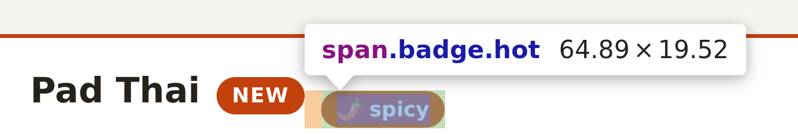
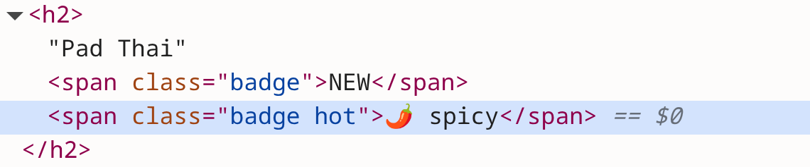
<!-- /slide -->

> Slide 6 replaces the next direction (the finished DOM carries data-* attributes).

> Browser right click, select spicy badge element on recipe of the day.

"DevTools says it's a span with class `badge hot`. So let's see if we can find that in the code."

> Do a global search in the editor for "badge hot".

"Right. No hit. But that class name could be composed some other way. Let's search for the text I can see instead; `spicy`."

> Do a global search in the editor for "spicy".

"Ok, so two hits are in the static recipe data. Only reason that comes up is because the data is hardcoded, not from a database. This other match looks promising, this could be the one. But without further scrutiny, this might relate to this other pill that shows `spicy`?"

> Point at the `spicy` tag-pill displayed under the stars rating

"It also does not tell me whether this affects the featured section, or the list below?"

> Point at `spicy` badge in featured section and regular section.

"I'm going to assume it does both. Let's make sure it's the right one. I'll just change the title real quick and see the change."

<!-- page "Save, refresh — nothing" @5:00
  slide 7
-->

<!-- slide 7 · edit, save, refresh -->
## 🖮💾⟳

```minimap arch 1 buffer,src,page
```

```diff
-       [:span.badge.hot "🌶 " t])]
+       [:span.badge.hot "🌶🔥 " t])]
```

{.stack}
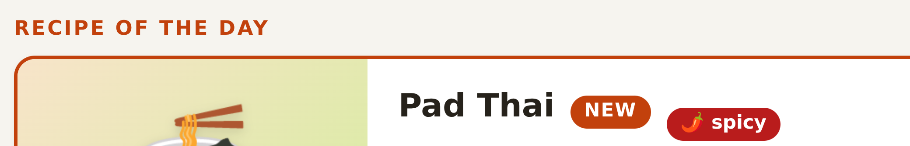
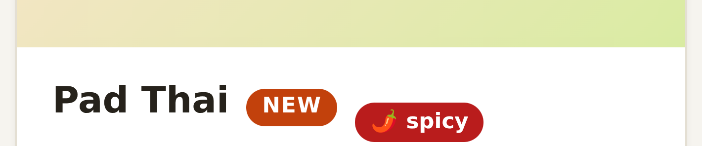
<!-- /slide -->

> Slides 7–8 replace the next two directions, the live loop (the watcher would reload on save).

> Add `Ctrl+Shift+U → type 1f525 🔥` inside `[:span.badge.hot "🌶 " t]`, save, return to browser.

"I don't see any change. Oh right, I need to refresh the page. Still nothing. Of course, I need to reload this source file first."

<!-- page "Reload the file, then refresh" @5:30
  slide 8
-->

<!-- slide 8 · load the file, refresh again -->
## 🔁

```minimap arch 1 e-eval,nrepl,views.v-main,page
```

{.repl}
```clojure
user=> (load-file "src/demo/views.clj")
#'demo.views/layout
```

{.stack}

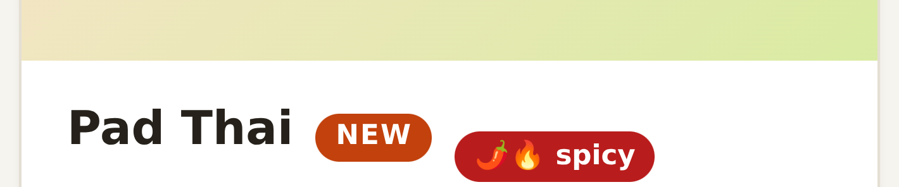
<!-- /slide -->

> Skip the next direction: never run load-file live, it strips the finished app's tags (§10).

> In REPL execute `(load-file "src/demo/views.clj")` and refresh browser.

"There! it looks like it affects both featured and regular badges. But this edit, reload, refresh loop will get really annoying really fast and this is about the most basic of tooling that we're missing here."

<!-- page "The map — every change: three hops by hand" @6:13
  slide 9
-->

<!-- slide 9 · the map, state 2 -->

{.flow-step}
```diagram arch 2
```
<!-- /slide -->

> New: the manual loop — save, a typed `(load-file …)`, F5 by hand.

> `a` plays three-hops, → next slide.

<!-- page "Save, and the page follows" @6:23
  slide 10
-->

<!-- slide 10 · the dev channel -->

{.flow-step}
```diagram arch 3
```
<!-- /slide -->

> New: the DEV ONLY band — the watcher, `/dev/ws`, `reload.js`,
> `dev-body` at the seam.

> `a` plays save-load, `a` plays save-reload, → next slide.

**[SLIDE 10: hot reload]** "I've set my editor to save when switching context. And when it does that, something should inform the server to reload the file. If that succeeds, something should let the browser know to do a page refresh. Of course I could let Calva or Emacs do the reloading but lets not rely on any particular editor unless we really have to. And of course, all the development tooling that we add should not ship to production. Using macros would be one way to do that, but deps tools gives us something out of the box."

<!-- page "One alias, and dev/ exists" @7:26
  slide 11
-->

<!-- slide 11 · deps.edn, one alias -->
# 🔧

```minimap arch 3 dev
```

```diff
  :deps {org.clojure/clojure {:mvn/version "1.12.4"}
         http-kit/http-kit   {:mvn/version "2.8.0"}
         hiccup/hiccup       {:mvn/version "2.0.0"}}

  :aliases
  {:nrepl {…}
+  :dev   {:extra-paths ["dev"]
+          :extra-deps  {…}}
  }
```
<!-- /slide -->

**[SLIDE 11: deps.edn]** "We'll start the REPL with an extra `:dev` alias. This split ensures that any library dependency or source file under that alias is excluded from the production build."

<!-- page "Watch the files" @8:01
  slide 12
-->

<!-- slide 12 · the watcher -->
# 📂👀

```minimap arch 3 watcher,e-poll,e-dep,e-notify
```

```clojure from=1 cursor=7:7
(loop [seen (modified-times)]
  (Thread/sleep 200)
  (let [current (modified-times)
        changed (changed-files seen current)]
    (when (seq changed)
      (reload-clojure! changed)
      (socket/notify-reload!))
    (recur current)))
```

`notify-reload!` when files (sources or resources) changed in the last 200 milliseconds. {.note}

<!-- /slide -->

**[SLIDE 12: the watcher]** "Watching for source file changes can be relatively easy, just poll every 200 milliseconds for any file change. Reload any and all that have been changed in the mean time."

<!-- page "One socket" @8:36
  slide 13
-->

<!-- slide 13 · the socket -->
# 💌🌐

```minimap arch 3 hub,e-wsreload
```

```clojure from=1 cursor=7:22
(defn broadcast! [msg]
  (let [s (json/write-str msg)]
    (doseq [ch @clients]
      (http/send! ch s))))

(defn notify-reload! []
  (broadcast! {:type "reload"}))
```

sends a `reload` message to all connected clients {.note}
<!-- /slide -->

**[SLIDE 13: the socket]** "http-kit can trivially setup a websocket. We can use that to restore our connection to browser, similar to what Vite, figwheel, shadow-cljs and others do. Server sent events would be an option here too, but in this case I went with websockets."

<!-- page "And the browser acts" @9:15
  slide 14
-->

<!-- slide 14 · the browser side -->
# ⟳

```minimap arch 3 devbody.d-script,seam,e-binds,reloadjs,e-reloadpage
```

```clojure from=1
(defn- dev-body [body]
  (list body
        [:script {:src "/dev/reload.js"}]))
```

```clojure
(def ^:dynamic *render-boundary* identity)     ; seam between app and dev
(binding [views/*render-boundary* dev-body] …) ; wrapper in :dev
```

```js from=1 cursor=3:28
ws.onmessage = function (e) {
  var m = JSON.parse(e.data);
  if (m.type === 'reload') location.reload();
};
```
<!-- /slide -->

**[SLIDE 14: the browser side]** "We need the browser to actually respond to data we send to it. That means we need to add dev only JavaScript to the application itself. We can do that by conditionally including that."

"This is a very well trodden path so I won't bore you with more details, but lets have a look whether this idea actually works *here*. We need to restart the REPL though, to include the new deps alias."

<!-- page "Save, and the page follows" [demo]
  slide 15
-->

<!-- slide 15 · the page follows -->
{.hero}
# ++DEMO++

```minimap arch 3 watcher,e-poll,e-dep,e-notify,hub,e-wsreload,devbody.d-script,seam,e-binds,reloadjs,e-reloadpage
```
<!-- /slide -->

> Run checkout step-1. Restart the REPL. Revert the local badge change. Show it works.

> Instead of the checkout and restart above: make the 🔥 edit now, save — the page follows; revert, save. Inspect mode off.

"As we can see this solves the first hurdle."

---

## §2 · The question, asked twice (10:21–11:34) — slides 16–18

> The wire is in and the page still knows nothing about itself. Ask the
> question here, answer *why not* here; everything after this is *how*.

<!-- page "The question — said twice" @10:21
  slide 16
-->

<!-- slide 16 · the question -->
## 🮰

```minimap arch 3 page,views.v-main
```

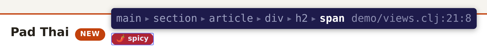

```clojure from=17 cursor=21:8
    [:h2 name
     (when new?
       [:span.badge "NEW"])
     (when-let [t (some #{"spicy"} tags)]
       [:span.badge.hot "🌶 " t])]
    [:p description]
```
<!-- /slide -->

**[SLIDE 16: the question — say it twice]** "Lets quickly get back to our original question. Where did this badge come from?"

<!-- page "The map — render deletes the structure" @10:40
  slide 17
-->

<!-- slide 17 · the map, state 4 -->

{.flow-step}
```diagram arch 4
```
<!-- /slide -->

> New: the page's `span.badge.hot` row, ✕ on the HTML wire —
> *just a string*: the structure is gone — and the amber ? from the page
> back to the views: no way back.

> `a` plays just-a-string, → next slide.

<!-- page "Why not: render deletes the structure" @10:50
  slide 18
-->

<!-- slide 18 · why not: render deletes the structure -->
## 🤔

```minimap arch 4 e-html,page.p-el
```

## What we have
```clojure
(hiccup2/html [:span.badge.hot "🌶 " t])
```

```html
<span class="badge hot">🌶 spicy</span>
```

## What we need
```clojure
(hiccup2/html {:data-src "demo/views.clj:21:8"} [:span.badge.hot "🌶 " t])
```
```html
<span class="badge hot" data-src="demo/views.clj:21:8">🌶 spicy</span>
```
<!-- /slide -->

**[SLIDE 18: why — render deletes the structure]** "Like the page refresh, we need to add something to the page to interact with the elements shown. To be able to do that, we need some kind of source mapping. This can be done in many ways of course, but adding it as data attributes seems straightforward enough."

---

## §3 · Why not? Can we? (11:34–12:16) — slides 19–20, then REPL

> The intellectual heart, and it is two slides rather than a typing beat:
> the default reader loses the position, tools.reader keeps it, and because
> Hiccup is data the rendered page can inherit it. Slow down — say "the
> position **is** part of the value", then leave the slide up. Don't start
> typing into the silence.

<!-- page "How? — what the reader could tell us" @11:34
  slide 19
-->

<!-- slide 19 · how? -->

```minimap arch 4 loader,e-read,src
```
## 🤔

- We already know which source file is loaded; {.big}
- Line & column data; only ==**R**==ead from ==**R**==EPL touches source file content {.big}
- Can it add ==metadata== to ++hiccup++ forms? {.big}

```clojure
(read-string "[:span.badge.hot \"🌶 \" t]")
→ [:span.badge.hot \"🌶 \" t]
(meta …) → nil
```
<!-- /slide -->

"The reader converts our source code file into actual data structures. To match this with line numbers, we need to do that in the reader. But our standard reader does not provide that. Should we build our own reader then?"

<!-- page "The reader that keeps the position" @11:54 compact
  slide 20
-->

<!-- slide 20 · the insight -->
## clojure.tools reader\
==indexing-push-back-reader==

```minimap arch 4 loader,e-read,src
```

```clojure from=1 cursor=4:17
(with-open [r (clojure.tools.reader.reader-types/indexing-push-back-reader
               "[:span.badge.hot
                \"🌶 \"
                t]")]
  (-> (clojure.tools.reader/read r)
      (nth 2)
      (#(vector % (meta %)))))
→ [t {:column 17, :end-column 18, :end-line 3, :line 3}]
```
<!-- /slide -->

"Fortunately not! Clojure has a reader that does exactly this. The metadata that is added is preserved throughout evaluation. Therefore, if we load our sources with hiccup code with this reader, we should be able to add the source mapping to the html generation."

---

## §4 · Keep the structure: `tr-load!` (12:16–14:24) — slides 21–22 → `step-2`

<!-- page "The map — tr-load! keeps the lines" @12:16
  slide 21
-->

<!-- slide 21 · the map, state 5 -->

{.flow-step}
```diagram arch 5
```
<!-- /slide -->

> New: `tr-load!` (read → eval); the watcher now loads the views
> through it.

> `a` swaps load-file for tr-load!, `a` plays save-trload, → next slide.

<!-- page "tr-load! — load, but keep the lines" @12:26
  slide 22
-->

<!-- slide 22 · the loader -->
## ==load==, ++eval++

```minimap arch 5 trload,views
```

```clojure from=1
(defn tr-load!
  [file]
  (let [rdr (rt/indexing-push-back-reader …)
        …]
    (binding [*ns* *ns*, *file* file, …]
      (eval ns-form) ; ns form first so that ::aliases resolve at read time
      (doseq [form body]
        (eval form)))))
```

Views load through ==`tr-load!`==, everything else through ==`load-file`.== {.note}
<!-- /slide -->

**[SLIDE 22: the loader]** "So that's the whole idea. Read the file with
tools.reader instead of the standard one, and stamp which file we're in onto
every element while we're there. The reader gives us line and column, but it
has no idea which file it came from, so we add that ourselves."

"One subtlety here: the `ns` form is evaluated *before* the rest
is read. Auto-resolved keywords (the double-colon ones) resolve at read
time, so the aliases have to exist first."

"And `element?` is just a guard: not every vector in your code is Hiccup. Let
bindings, tuples, pull patterns. We only touch vectors whose head is a bare
HTML tag keyword."

> Run checkout step-2.

"From now on views load through this loader, and nothing else does."

<!-- page "A runtime value that knows its source" @13:40
-->

**[demo — REPL]** `(meta (last (demo.views/recipe-card (first demo.main/recipes))))`
→ `{:file "demo/views.clj", :line 16, :column 4, …}` — point at line 16 in the
editor: the card's `[:div …]` body. "A runtime value that
knows its source. The hard part of this talk is already done — and yet
nothing visible has changed. The *value* knows; the browser has no idea,
because Clojure metadata doesn't survive into an HTML string. How does the
knowledge cross the wire?"

*(Ask for the `last` element, the card's body. On the finished app the
component wrapper from §7 rebuilds the root vector and `into` drops its
metadata, so `(meta (recipe-card …))` itself is `nil`; the literals inside keep
theirs. Verified on `main`.)*

---

## §5 · Carry it to the DOM: `tag-tree` (14:24–17:09) — slides 23–28 → `step-3`

<!-- page "The map — metadata becomes attributes" @14:24
  slide 23
-->

<!-- slide 23 · the map, state 6 -->
{.flow-step}
```diagram arch 6
```
<!-- /slide -->

> New: `tag-tree` in `dev-body` at the seam; the page's `data-src` row.
> The ? is gone: the browser's inspector shows each element's
> file:line:col — the lookup is still by hand.

> `a` plays tag-render, → next slide.

<!-- page "How tag-tree walks the tree"
  slide 24
-->

<!-- slide 24 · tag-tree walks the tree -->
## 🌳

```minimap arch 6 devbody.d-tag,page.p-src
```

```clojure from=1 cursor=10:10
(defn tag-tree [node]
  (cond
    (vector? node)
    (let [m (meta node)
          children (mapv tag-tree node)]
      (if (and (element? node) …)
        (let [attrs … body …]
          (into [(first children)
                 (assoc attrs
                   :data-src (str (:file m) ":" (:line m) ":" (or (:column m) 1))
                   …)]
                body))
        children))
    (seq? node) (doall (map tag-tree node))
    :else node))
```

```diff
(defn dev-body [body]
-  (list body
+  (list (inspector/tag-tree body)
        [:script {:src "/dev/reload.js"}]))
```

<!-- /slide -->

<!-- page "The inspector shows file:line:col" [demo]
  slide 25
-->

<!-- slide 25 · the inspector shows file:line:col -->
{.hero}
# ++DEMO++

```minimap arch 6 trload,e-deftr,views,e-html,seam,e-binds,devbody.d-tag,page.p-src
```
<!-- /slide -->

<!-- page "tag-tree — metadata becomes attributes" @14:34
  slide 26
-->

<!-- slide 26 · metadata becomes attributes -->
# 🏷 metadata → attributes

```minimap arch 6 devbody.d-tag,seam,page.p-src
```

```clojure
;; tag-tree walks the assembled page; for every element that carries
;; reader metadata, it rebuilds the vector with its position as an attribute:
(assoc attrs
  :data-src (str (:file m) ":" (:line m) ":" (:column m))
  …)
```

```clojure
(defn- dev-body [body]
  (list (inspector/tag-tree body)         ; ← the only change in the app
        [:script {:src "/dev/reload.js"}]))
```

the render boundary: where hiccup meets the stringifier {.note}
<!-- /slide -->

**[SLIDE 26: metadata becomes attributes]** "The browser can't read Clojure
metadata. So somewhere between the views running and hiccup turning them into
a string, we walk the tree once and turn that metadata into real attributes.
Elements without it pass straight through."

"And notice where it hangs: the render boundary. This app has exactly one —
the layout. If you render htmx fragments from five endpoints, funnel them
through one helper and tag there."

"In production nothing binds that seam. Nothing *could* — the walk isn't even
on the classpath."

> Run checkout step-3.

<!-- page "That div now remembers" @15:32
  slide 27
  slide 28
-->

<!-- slide 27 · minute one · now -->
## 🏷 minute one · now

```minimap arch 6 page.p-src
```

{.stack}
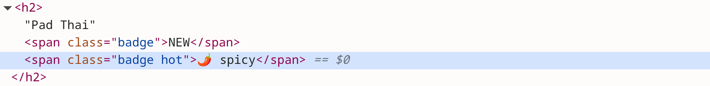
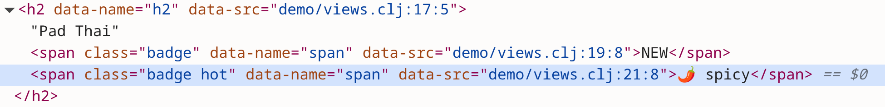
<!-- /slide -->

<!-- slide 28 · eight cards, one line -->
## 🗂️ eight cards, one line

```minimap arch 6 page.p-src
```

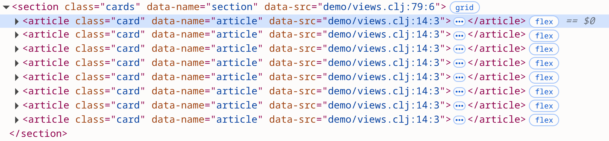
<!-- /slide -->

> Slide 27 at the callback, slide 28 at the scroll, instead of live DevTools. Their `data-name` is the bare tag; names arrive in §7.

**[demo — the callback]** Browser reloads on save. Open DevTools, inspect
**the same crooked pill from minute one** →
`<span class="badge hot" data-src="demo/views.clj:21:8">`. **[BEAT — let it
sit]** "That div now remembers. This attribute is the entire thesis of the
talk rendered into one line of HTML: the structure we used to delete, kept,
as a thread back to the source." Quick scroll of the Elements panel: "and
it's on *every* element — 365 of them on this page, and it even knows its
namespaces apart: the stars say `demo/ui/views.clj`. Note the eight card
roots all say the same line; one template line, eight renders, exactly as
promised. So the page finally knows where it came from — and clicking it
still does nothing. It knows, and it can't *tell* anyone. Who would it even
tell?"

---

## §6 · The overlay, and a click that opens your editor (17:09–20:07) — slides 29–33 → `step-4`

<!-- page "The map — a click that travels" @17:09
  slide 29
-->

<!-- slide 29 · the map, state 7 -->
{.flow-step}
```diagram arch 7
```
<!-- /slide -->

> New: `inspector.js`, `open` over `/dev/ws`, dispatch, the two shields
> (`origin-ok?` at the /dev/ws handshake, `resolve-src` on the dispatch),
> `code -g` into the editor. The ? is gone.

> `a` plays click-open, → next slide.

<!-- page "The overlay, the trust boundary, the dispatch" @17:24
  slide 30
-->

<!-- slide 30 · a click that travels -->
## 🖱

```minimap arch 7 overlay,e-wsinsp,hub.h-disp,e-codeg
```

```js
function sendOpen(src) {                  // src is "file:line:col"
  var p = src.split(':'), col = +p.pop(), line = +p.pop();
  ws.send(JSON.stringify({type: 'open', src: p.join(':'), line, col}));
}
```

```clojure
(defn handle-msg! [ch msg]                ; typed messages, one socket
  (case (:type msg)
    "open" (handle-open! ch msg)
    nil))

(defn- resolve-src [src]                  ; a browser can send ANY string
  (when (and (.exists f) (str/ends-with? (.getName f) ".clj")
             (.startsWith (.toPath f) (.toPath root)))
    f))
```

shell to: `code -g file:line:col` {.note}
<!-- /slide -->

**[SLIDE 30: a click that travels]** "The overlay is about two hundred lines
of plain JavaScript and no framework. It walks up the `data-src` ancestors to
build the breadcrumb, and on a click it peels the file, line and column apart
and sends them down the socket we already have."

"On the server, the dispatch grows by adding a case. The hub never learns
what any of it means."

"Then the part I want you to actually look at: the border asks two questions.
Which files may be named? A browser can send any string, so we canonicalize
it, require a `.clj`, and confine it to `src/` with a real path check — not a
string prefix. And who may speak? WebSockets aren't same-origin restricted,
so any page you have open could knock. Browsers always announce their origin;
native clients send none. Anything else gets a 403."

"Opening the file is the naive part: shell out to `code -g`. It works, and it
has one flaw we fix when the editor joins the conversation."

> Run checkout step-4.

<!-- page "From a pixel to a paren" @18:53
  slide 31
-->

<!-- slide 31 · pixel → paren -->
## 🖱

```minimap arch 7 page.p-src,buffer
```


```clojure from=17 cursor=21:8
    [:h2 name
     (when new?
       [:span.badge "NEW"])
     (when-let [t (some #{"spicy"} tags)]
       [:span.badge.hot "🌶 " t])]
    [:p description]
```

`demo/views.clj` — the click lands on line 21, column 8 {.note}
<!-- /slide -->

<!-- page "Hover, click, and the editor jumps" [demo]
  slide 32
-->

<!-- slide 32 · hover, click, the editor jumps -->
{.hero}
# ++DEMO++

```minimap arch 7 page.p-src,e-click,overlay,e-wsinsp,hub.h-disp,e-codeg,buffer
```
<!-- /slide -->

> Slide 31 instead of the live toggle, hover and click (the live crumb already shows names and () λ).

**[demo]** Toggle the badge (Alt+Shift+I). Hover around: boxes + breadcrumbs
(`main ▸ section ▸ article ▸ div ▸ h2 ▸ span`) — spend 20 seconds just
wandering: a star, a pill, an icon; every pixel answers. Hover the crooked
pill — click → **your editor jumps to `views.clj` line 21, column 8.**
"From a pixel to a paren. And now the fix isn't a guess — and notice it
isn't the guess I would have made: the obvious move is to straighten
`.badge`, and that would shove the NEW badge too. The element just told me
it came from `[:span.badge.hot …]`, so `.hot` is the hook."

<!-- page "One rule less" @19:35 [demo]
  slide 33
-->

<!-- slide 33 · one rule less -->
## 📏 one rule less

```minimap arch 7 page.p-el
```

{.stack}
 {.guide}
 {.guide}
<!-- /slide -->

> Live fix with inspect mode off; slide 33 if it misbehaves. After the talk: `git -C demo checkout resources/style.css`.

Remove the `top: .45rem` rule from `.badge.hot` in `style.css`, save → the
pill straightens, NEW stays where it was.
"See it, point at it, fix it, see it again. The question from minute
one is answered. But look at what the breadcrumb *says*: `article`, `div`,
`span`. True, and useless — nobody thinks in divs. I think in `recipe-card`.
What *made* this thing?"

---

## §7 · Components: name what produced it (20:07–22:33) — slides 34–36 → `step-5`

<!-- page "The map — name what made it" @20:07
  slide 34
-->

<!-- slide 34 · the map, state 8 -->
{.flow-step}
```diagram arch 8
```
<!-- /slide -->

> New: the `wrap` cell in `tr-load!`, and its wire into the views: the
> loader re-defs them wrapped; and the page's `data-name` row (ns/fn).

> `a` plays wrap-load, → next slide.

<!-- page "instrument-var! — the loader does it all" @20:17
  slide 35
-->

<!-- slide 35 · what made this -->
# 🧩 name what made it

```minimap arch 8 trload.c-wrap,views
```

```clojure
(defn instrument-var! [v]                 ; v is a plain view defn
  (let [orig (or (::orig (meta @v)) @v)   ; idempotent across reloads
        m    (meta v)                     ; the VAR knows its file and line
        src  (str (:file m) ":" (:line m) ":" (:column m))
        nm   (str (ns-name (:ns m)) "/" (:name m))]
    (alter-var-root v (constantly
      (with-meta (fn [& args] (tag-hiccup (apply orig args) src nm))
                 {::orig orig})))))
```

```clojure
(instrument-ns! (ns-name *ns*))           ; ← one line, inside tr-load!
```

the var now holds the wrapper. the source on disk is untouched {.note}

no annotations, no registry. the loader takes care of it. {.sub}
<!-- /slide -->

**[SLIDE 35: name what made it]** "An element's position can't answer 'what
made this'. That needs the enclosing `defn` — and the var already knows its
own file and line."

"So the loader wraps every function a view namespace defines. The wrapper
stamps the var's location onto whatever root element comes back. The `::orig`
marker keeps it idempotent, so reloading re-wraps cleanly instead of wrapping
the wrapper."

"And we map it over the whole namespace. In these view namespaces wrapping
every plain function is harmless, so there's no registry to maintain, and
your views stay plain `defn`s."

"Be precise about what that means, because it surprises people: the loader
*replaces the var*. After this, `demo.views/recipe-card` is no longer the
function you wrote — it's a wrapper that calls it. Your file on disk is
untouched; the var changed. Call a view from the REPL now and you get the
tagged root back, not your literal. The original is one lookup away, under
`::orig`."

> Run checkout step-5.

<!-- page "The breadcrumb names the whole tower" @21:46
  slide 36
-->

<!-- slide 36 · the whole tower, named -->
## 🧩 the whole tower, named

```minimap arch 8 page.p-name
```

{.stack}
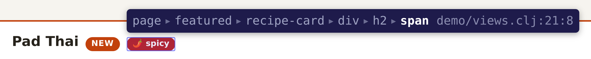
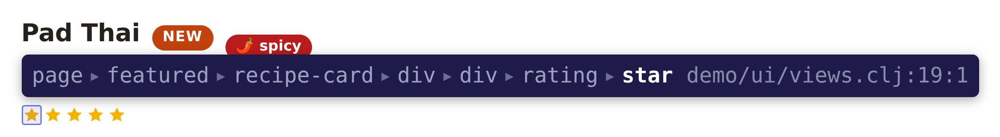
<!-- /slide -->

> Slide 36 instead of the live hover and the card-root click (live crumbs show () λ).

**[demo]** Save `inspector.clj` — watch the terminal: the engine reloads AND
the views re-tag themselves (§4's one line, earning its keep). Hover a star:
the breadcrumb now names the whole tower —
`page ▸ featured ▸ recipe-card ▸ div ▸ div ▸ rating ▸ star`. Click a card's *root*
→ your editor opens the `defn recipe-card` line. "Views stayed plain
`defn`s — no annotations, no registry. The loader did it all. So the page
can now point at your code, precisely, in your vocabulary. One direction.
Can the conversation go the other way — can the *code* point at the *page*?"

---

## §8 · The reverse direction: your cursor drives the browser (22:33–25:43) — slides 37–40 → `step-6`

> THE KNOCKOUT. Protect it (see the hard gate in the cuts section), and when
> the stars light, stop talking for three full seconds.

<!-- page "The map — your cursor drives the browser" @22:33
  slide 37
-->

<!-- slide 37 · the map, state 9 -->
## 🗺 your cursor drives the browser

{.flow-step}
```diagram arch 9
```
<!-- /slide -->

> New: Joyride on `/dev/ws` and the `index` cell; in green, the cursor
> path: `resolve-cursor`, `highlight` → `inspector.js` → page. `open`
> now rides the Joyride wire; `code -g` is the fallback.

> `a` plays cursor, → next slide.

<!-- page "An index, an agent, a highlighter" @22:48
  slide 38
-->

<!-- slide 38 · the other direction -->
# ↩ the other direction

{.rev}
```minimap arch 9 trload.c-index,e-resolve,joyride,e-wsjoy
```

```clojure
(defn resolve-cursor [file line col]      ; → the SAME strings the DOM has
  (when-let [{:keys [defns elements]} (get @view-index file)]
    (when-let [d (innermost defns line col)]
      {:component (:name d)                     ; matches data-name
       :element   (:key (innermost elements line col))})))  ; matches data-src
```

```clojure
;; the editor agent, in ClojureScript, inside VS Code
(ws-send! {:type "cursor" :file file :line line :col col})
```

the index is built by the same read pass — that's what the\
`:end-line`/`:end-column` were for {.note}
<!-- /slide -->

**[SLIDE 38: the other direction]** "This is the half I wanted most: let the
code point back at everything it rendered. Three small things — an index, an
agent in the editor, and a highlighter."

"The index comes free. We're already reading every view file, so while we're
in there we remember each `defn`'s span and each element literal's span.
Those end positions from the REPL a moment ago — this is what they were for."

"Then the cursor resolves to strings that are *byte-identical* to what we
stamped into the DOM. The browser match is one attribute selector. There is
no fuzzy matching anywhere in this."

"And the agent is a Joyride script — ClojureScript running inside VS Code's
extension host. The whole editor API, nothing to build or package. It reports
the cursor, debounced, and receives the opens — which means `code -g` is
demoted to a fallback."

> Run checkout step-6. Then run *Joyride: Run Workspace Script*.

<!-- page "Your cursor drives the browser" @24:07 [demo]
  slide 39
-->

<!-- slide 39 · the other direction -->
{.hero}
# ++DEMO++

{.rev}
```minimap arch 9 joyride,e-wsjoy,hub,e-resolve,trload.c-index,e-wsinsp,overlay,e-light,page.p-el
```
<!-- /slide -->

<!-- page "The knockout — all forty-five stars" @24:49 [the knockout]
  slide 40
-->

<!-- slide 40 · forty-five -->
## ⭐ forty-five

{.rev}
```minimap arch 9 joyride,page.p-el
```


<!-- /slide -->

Then the knockout: switch files to
`ui/views.clj`, cursor into `star`'s body — **all forty-five stars on the
page ignite. SAY NOTHING. Three seconds.** Then: "my cursor is in the UI-kit
namespace; those elements were rendered by the page namespace. Your editor
and your page are one connected surface now. And notice: *all* instances
light, every time — the DOM is telling the truth about one template, many
renders. Which raises the last question of the day: what if I mean *that
one*?" **[point at the featured card]**

---

## §9 · Call sites: telling instances apart (25:43–29:57) — slides 41–44 → `step-7`

<!-- page "The map — which call made it" @25:43
  slide 41
-->

<!-- slide 41 · the map, state 10 -->
## 🗺 which call made it

{.flow-step}
```diagram arch 10
```
<!-- /slide -->

> New: the `call sites` cell, between read and eval; the page's
> `data-callsite` row — on component roots only, so the element row
> reads `span / article`.

> `a` plays callsite-load, `a` plays callsite-render, → next slide.

<!-- page "Same function, two call sites, told apart" @25:53
  slide 42
-->

<!-- slide 42 · which call made it -->
# 🎯 which call made it

```minimap arch 10 trload.c-calls,page.p-call
```

```clojure
;; during the load, each call to a view fn is rewritten:
(recipe-card r)  →  (tag-callsite "demo/views.clj:81:9" (recipe-card r))
```

```clojure
(defn- wrap-callsites [names file form wrap?]
  …
  (if (and wrap? (call-head names form) (form-span form))
    (with-meta                                  ; ← re-attach, or the
      (list `tag-callsite (src-key file (form-span form)) walked)
      (meta form))                              ;    element tags break
    walked))
```

guards: only known view fns · never inside `->` or `quote` {.note}

rewriting between read and eval — a step no Clojure loader has {.sub}
<!-- /slide -->

**[SLIDE 42: which call made it]** "Three `(stat …)` calls, three identical
roots — and nothing in the DOM records which call made which one. So while
we're loading, each call to a view function gets rewritten to carry its own
invocation site."

"This is the one piece I won't ask you to watch me type — rewriting source is
delicate and the code is defensive. Three guards make it safe. We only
rewrite heads that resolve to a known view function: an unqualified call this
file defines, or an alias-qualified call into a views namespace. Never inside
threading macros or `quote`, where rewriting would change what the code
means. And every rebuilt form re-attaches its reader metadata — get that
wrong and the element tags from twenty minutes ago break silently."

> Run checkout step-7.

Point at the terminal while it lands: "the watcher just loaded the new
engine, re-tagged the views, and reloaded the page. One command, whole
state."

<!-- page "Eight grid cards, or just the featured one" @27:17 [demo]
  slide 43
-->

<!-- slide 43 · eight, or one -->
## 🎯 eight, or one

{.rev}
```minimap arch 10 joyride,page.p-call
```

{.pair}
`, line 81 → eight")
`, line 38 → one")
<!-- /slide -->

<!-- page "The payoff pair" [demo]
  slide 44
-->

<!-- slide 44 · the payoff pair -->
{.hero}
# ++DEMO++

{.rev}
```minimap arch 10 joyride,e-wsjoy,hub,e-resolve,trload.c-index,trload.c-calls,e-wsinsp,overlay,e-light,page.p-call
```
<!-- /slide -->

> Live; slide 43 as backup.

**[demo — the payoff pair]** `recipe-card` is called from TWO places: the
grid's `for`, and `featured`.
1. Cursor on the grid's `(recipe-card r)` (line 81) → **the eight grid
   cards light — and the featured card, same component, stays dark.**
2. Cursor on `featured`'s `(recipe-card r)` (line 38) → **only the featured
   card.** "Same function, two call sites, told apart on screen. And there
   is minute one, answered: one line made all three spicy pills — and the
   page can now say which call made which, so I can give the big card its
   word and leave the grid alone."

---

## §11 · What it generalizes to + close (33:59–38:00) — slide 45

<!-- page "Stay connected to what you make. Build the tools you miss." @35:44
  slide 45
-->

<!-- slide 45 · close -->
# ++Stay connected to what you make.++\
Build the tools you miss.

## source available @\
==https://github.com/mapidentity/conj-2026==

<!-- /slide -->

**[SLIDE 45: close]** "We started with Bret Victor's principle — an
immediate connection to what you make — and the one place our stack broke
it: a crooked pill nobody could trace. Now the connection runs both ways,
and the gap between the tools you have and the tools you can imagine turned
out to be about a weekend wide. **Hiccup is just data. So inspect it.**
Thank you." → Q&A (2:00).

---

## The hard gate (decide now, not on stage)

The knockout (§8) sits in the riskiest slot — last-ish — and it is
untouchable. So: **if §7 has not STARTED by 25:00, skip its slide entirely**
(`git switch -f step-5`, hover a star, let the breadcrumb make the point,
move on). **If §8 has not started by 27:30, §9 is spoken, not
demoed** (one sentence + the breadcrumb `()`/`λ` hover, which needs no
cursor work). §8 always gets its whole slot — 23:29–27:12, the clock at the
top of the section, not a vaguer "five minutes" — and its three seconds of
silence. Never rush the stars.

## Cuts if running long (drop in order)

1. §6's live badge *fix* (keep the click→editor jump; the fix is 20s but cuttable).
2. §9's third beat, the cross-namespace `(ui/stat …)` proof — the payoff
   pair already made the point; this one is reassurance, not revelation.
3. §10's REPL beat (the seam is `identity`) — one spoken sentence instead.
4. §9's guard narration (slide 42) — show the slide, say "three guards keep
   it safe", checkout, go straight to the payoff pair. (Never cut the payoff
   pair; it's the talk's most distinctive 40 seconds.)
5. §7's slide narration — checkout, hover a star, let the breadcrumb make the
   point on its own (saves ~60s).

## Stretch if running short

- §8: also put the cursor inside `layout` — nothing lights (it returns a
  string, no root element) and nothing breaks: DOM-as-truth means the
  resolver can propose and the page disposes. The book version draws a
  bounding box over the layout's span members instead.
- §5: prod, for real: `clj -M -e "(require 'dev.inspector)"` from the
  cheatsheet (§10) — "Could not locate"; needs a ~10s JVM boot, hence
  stretch-only.

## Rehearsal checklist

- [ ] Full run ×3 against the clock; each section has a hard out (the
      timings above). Every section is slide → narration → checkout, so
      running long means trimming narration, never the checkout.
- [ ] Record the fallback clip at `step-7` (both directions + `()`/`λ`).
- [ ] Rehearse the recovery move once deliberately: sabotage a paren in §5,
      `git switch -f step-3`, keep talking. Muscle memory.
- [ ] At `step-7` during rehearsal: verify the Joyride agent connects
      ("Joyride: Run Workspace Script"; check the extension-host console) and
      that both directions work end to end. Then return to `step-0` for the
      talk — the script leaves the working tree with the checkout.
- [ ] The badge OFF in localStorage before starting; DevTools docked+closed;
      terminal font; browser zoom.
- [ ] `git switch step-0` + `git status` clean + server up + one hover
      test at `step-7` then BACK to step-0 (leaves ~/.m2 warm and the clip
      fresh in your fingers).

## Likely Q&A (adapted from the proposal draft)

- **"Only VS Code?"** The browser→source half is editor-agnostic — it's one
  socket message; `code -g` works with zero editor code. The agent is ~80
  lines of Joyride; the same contract ports to any editor that can hold a
  WebSocket and move a cursor (Emacs: websocket.el + `xref--goto`).
- **"Performance?"** Two costs, both dev-only, and be precise: the
  tools.reader read + wrapping + indexing is paid per view file per
  (re)load; the render-boundary walk (`tag-tree` + the per-call wrappers)
  IS per request in dev — one linear pass over the tree, microseconds on
  this page. Prod has neither: normal loads, and nothing binds the render
  boundary — it stays `identity`.
- **"Why not a SPA framework's devtools?"** They read a live component tree
  the framework maintains in the browser. We don't ship one — the point is
  you don't need to: manufacture the map at load time instead.
- **"What about `(for …)` iteration N?"** Can't — one call site, N renders;
  they're intentionally the same family. If instances must be told apart,
  that's data identity, not source identity: put an id in your markup.
- **"Macros that generate Hiccup?"** Honest answer: syntax-quote strips
  reader positions (verified — the expansion's meta is `nil`), so
  syntax-quoted macro output is invisible to the *element* layer; clicks
  fall back to the nearest tagged ancestor, and the *component* layer still
  tags the calling fn's root via the var. Only an unquoted literal in a
  macro body keeps its position. Components composed via `->` lose
  call-site tags (the guard refuses) but keep everything else.
- **"Why not ClojureStorm / FlowStorm?"** Different tool: Storm records
  *execution* (we use it for a construction-view tracer in the book — see
  ch. 16–17). This is a *static* thread from pixels to source: it needs no
  execution tracing and no compiler swap, and its runtime cost is the
  dev-only render-boundary walk — production has neither. They compose
  beautifully, and that tracer talk is the sequel.
- **"Hiccup compiles some literals — does instrumentation break it?"** We
  never touch hiccup's compiler: tag-tree runs on the data before
  stringification in dev, and in prod nothing runs at all.
- **"Security of the dev socket?"** Three layers, each for a different
  attacker: the network boundary (nothing is published outside the compose
  network; running bare, tighten the `0.0.0.0` bind back to loopback),
  `resolve-src` (what a peer may name), and the Origin gate (who may speak —
  WebSockets aren't same-origin-restricted, so without it any page in your
  own browser could connect; that's the webpack/Vite dev-server CVE class).
  Dev-only either way; don't expose it.
- **"I serve htmx fragments, not full pages — where does `*render-boundary*` go?"**
  At the render boundary: wherever hiccup meets the stringifier. This app
  has one (the layout); if you render fragments from several endpoints,
  funnel them through one `render` helper and tag there — the rule is one
  boundary per stringify, not one per app.
- **"You're replacing my vars?"** Yes — `instrument-var!` calls
  `alter-var-root`, so in a dev JVM a view var holds a wrapper that calls
  your function and tags the root it returns. Three things make that livable:
  it only happens on the dev classpath (prod never loads the loader, so the
  vars are exactly what you wrote); it's idempotent, because the wrapper
  stashes the original under `::orig` and unwraps before re-wrapping; and the
  original is always one lookup away —
  `(::dev.inspector/orig (meta @#'demo.views/recipe-card))`. The visible cost
  is in the REPL: call a view directly and you get the tagged root — an
  injected attribute map, and no reader metadata on the value. Tests that
  call views directly should use `::orig`, or run without the `:dev` alias.
- **"My views are `defmethod`s / built by a def-macro?"** Then both
  directions go quiet for them: `defn-form?` only knows `defn`/`defn-`, and
  `instrument-var!` gates on `fn?` (false for MultiFn). Plain-`defn` views
  are the demo's and the book app's convention; extending the recognizer
  and the gate is a genuinely good first PR.
- **"The reverse highlight while my buffer is dirty?"** The index holds
  on-disk spans, so unsaved edits drift until you save — the watcher
  re-indexes on save. Everyday practice (save-driven views) makes this
  invisible; it's still worth saying out loud.
- **"Why your own watcher? Isn't reloading solved?"** The *what* is, and we
  use it: tools.namespace decides what reloads, in which order. The *how*
  isn't pluggable: every reloader ends in Clojure's loader, whose reader never
  records where a vector sits — and the ones that unload (`refresh`,
  clj-reload) would orphan the running server. Hooking `load` (it's
  `^:redef`) reaches `require`, not your editor; a core patch would put reader
  positions on runtime values, which core deliberately keeps off (CLJ-2945).
  Notes: `research/why-our-own-loader.md`.
- **"Eval-driven teams?"** The discipline rule ("the watcher owns view
  loads") really does mean no alt-Enter on view defns — a single-form eval
  strips that fn's tags just like the buffer-load demo. The structural fix
  is to make the editor's load path go *through* the loader — an nREPL
  middleware routing view-namespace `load-file`/eval through `tr-load!` —
  which the single-source-of-truth rule begs for; neither the demo nor the
  book builds it yet.
- **"The abstract said hover-to-jump."** Precisely: hover shows (box +
  breadcrumb), click jumps. You want the click — hover-jumping would yank
  your editor around on every mouse move.

---

## The map (diagram source)

> The one architecture diagram, written once here and drawn state by state:
> a map slide shows state K with ```` ```diagram arch K``` ````, a code slide
> carries a minimap with ```` ```minimap arch K ID,…``` ````. One state per talk
> section (the captions are the map slides' headings), keyed to the sections,
> not to branches. The look lives in `presenter/diagram.*`; the DSL is
> `presenter/DIAGRAM.md`. Not spoken, not in the deck.

<!-- diagram arch · the map: one picture that grows by section; a slide shows state K with ```diagram arch K``` -->
```text
canvas 1760x870

# the states, in talk order. The caption is the map slide's heading and the SVG's aria-label.
step 1  "a webserver, a REPL, an editor"
step 2  "every change: three hops by hand"
step 3  "hot reload"
step 4  "render deletes the structure"
step 5  "tr-load! keeps the lines"
step 6  "metadata becomes attributes"
step 7  "a click that travels"
step 8  "name what made it"
step 9  "your cursor drives the browser"  +rev:e-resolve,p-cursor,p-high,e-light
step 10 "which call made it"
step 11 "a plain load strips the tags"
step 12 "the inspector doesn't ship"      hide:editor,nrepl,dev,reloadjs,overlay,page.p-src,page.p-name,page.p-call
step 13 "both directions, one JVM"        summary  +fwd:e-click,p-open,p-jopen  +rev:p-cursor,e-resolve,p-high,e-light

# ---- lanes: the processes, and the files between them ------------------------------
region editor  lane  "EDITOR"    0,16     196x846
region disk    store "FILES"     210,156  156x264
region jvm     lane  "JVM"       380,16   1020x846
region dev     band  "DEV ONLY"  396,292  988x556  capx=630  @3
region browser lane  "BROWSER"   1414,16  346x846

# ---- §1 the cast: an editor, the files, one JVM, a page ----------------------------
node calva   "Calva"      14,50    146x64
node buffer  "buffer"     14,318   136x64
node src     "src/"       240,180  128x202  mono
node nrepl   "nREPL"      430,50   150x64
node httpkit "http-kit"   760,50   170x64
node views   ""           710,160  280x104
  row v-main  "demo.views"     mono  +11-11:warn
  row v-ui    "demo.ui.views"  mono
node page    "page"       1430,50  314x236  list
  row p-el    "span.badge.hot" mono  @4  10:'span / article'
  row p-src   "data-src"       mono  @6
  row p-name  "data-name"      mono  @8
  row p-call  "data-callsite"  mono  @10

edge e-eval   calva:r -> nrepl:l             "eval"  below  2-2:'(load-file …)'  3:''  11-11:'Load buffer'  +2-2:human  +2-2:new  +11-11:warn
edge e-call   httpkit:b -> views:t
edge e-get    page:l=82 -> httpkit:r         "GET /"  t=.5
edge e-html   views:r -> page:l=212          "HTML"   t=.648  below  4-5:'just a string'

# ---- §1 the manual loop: save, a typed load-file, F5 --------------------------------
# load-file: until tr-load! replaces it (the swap in state 5); back in 11 as the second loader
# (Calva's Load buffer, through nREPL: it gets the buffer, not the file); in 12 prod's `require`
node loader  "load-file"  420,180  220x64   mono  @2-4,11,12  12-12:require  +11-11:warn
edge e-save   buffer:r -> src:l=350          "save"   @2  +2-2:human
edge e-read   src:r=212 -> loader:l                   @2-4,12
edge e-repl   nrepl:b -> loader:t                     @2-4,11  +11-11:warn
edge e-def    loader:r -> views:l            ""       mono  @2-4,11,12  2-2:def  3:''  11-11:def  +11-11:warn
node you     "you"        1500,400 120x64   @2,11  +11-11:new
edge e-f5     you:t -> page:b=1560           "F5"     human  left  @2,11  +11-11:new
edge e-gap    page:l=170 -> views:r=170      ""       gap  @4-5
mark m-gap    q ""        1250,170  @4-5

# ---- §1 hot reload: the watcher, one socket, the browser side, the render boundary ---
node watcher "watcher"    420,318  180x64   @3
edge e-poll   src:r=350 -> watcher:l                  @3
edge e-dep    watcher:t=510 -> loader:b=510           @3-4
node hub     "/dev/ws"    560,620  220x212  mono  @3
  row h-disp "dispatch"   @7
edge e-notify watcher:b=580 -> hub:t=580              @3
node reloadjs "reload.js" 1430,658 210x64   mono  @3
edge e-wsreload hub:r=690 -- reloadjs:l      ws  @3
pill p-reload on e-wsreload "reload" >  t=.5  @3
edge e-reloadpage reloadjs:t=1470 -> page:b=1470  "reload()"  mono  t=.5  @3  4:''
node seam    ""           1030,196 22x32    @3
note seam-l  "seam"       1060,250  mono  @3  4-5:''  12-12:identity
node devbody "dev-body"   900,304  220x148  mono  list  @3
  row d-script "+<script>"  mono  @3
  row d-tag    "tag-tree"   mono  @6
edge e-binds  devbody:t=1041 -> seam:b                @3

# ---- §2 the question: render deletes the structure ------------------------------------
mark m-render cross ""    1150,212  @4-5

# ---- §4 a loader that keeps the lines --------------------------------------------------
node trload  "tr-load!"   620,470  750x120  mono  @5
  cell c-read  "read"        @5
  cell c-calls "call sites"  @10
  cell c-eval  "eval"        @5
  cell c-wrap  "wrap"        @8
  cell c-index "index"       @9
edge e-views  watcher:r -> trload:t=700               @5
edge e-deftr  trload:t=860 -> views:b=860             @5  +8-8:new

# ---- §6 a click that travels -------------------------------------------------------------
node overlay "inspector.js" 1430,780 314x64  mono  @7
edge e-click  page:b=1680 -> overlay:t=1680  "click"  left  t=.6  @7
edge e-wsinsp hub:r=812 -- overlay:l          ws  @7
pill p-open  on e-wsinsp "open"  <  t=.3  @7
edge e-codeg  hub:l=700 -> buffer:b=82       "code -g"  t=.6  @7  +9-:fallback
mark m-origin  shield "origin-ok?"   802,726   @7  9:
mark m-resolve shield "resolve-src"  802,764   @7  9:

# ---- §8 the other direction ----------------------------------------------------------------
node joyride "Joyride"    14,780   164x64   @9
edge e-wsjoy   joyride:r -- hub:l=812        ws  @9
pill p-cursor on e-wsjoy "cursor"  >  t=.27  @9
pill p-jopen  on e-wsjoy "open"    <  t=.78  @9
edge e-resolve hub:r=650 -> trload.c-index:b  "resolve-cursor"  mono  t=.5  @9
pill p-high   on e-wsinsp "highlight"  >  t=.72  @9
edge e-light  overlay:t=1720 -> page:b=1720   @9

# ---- the final view's key: the two loops, in the overlay's colours ----------------------------
key k-fwd fwd "page → code"  1100,106  @13
key k-rev rev "code → page"  1100,150  @13

# ---- animations: flows and swaps, a bare @K is state K only; on a {.flow-step} slide, a plays the next one, p steps back ----
# a hop list: EDGE[<] ["MSG"] · EDGE at ID+ID… (a waypoint: the token stops there, the ids light) ·
# NODE.PART[+ID…] (a station, and what lights with it) · `|` a new leg (a restart elsewhere)
# §1: a request goes in, HTML comes out, and it stops at the page
flow request @1 lands=page            : e-get, e-call, e-html
# §1: three separate starts by hand (the buffer, Calva, you) before the page shows a change
flow three-hops @2 lands=page         : e-save | e-eval, e-repl, e-def | e-f5, e-get, e-call, e-html
# §1: the watcher loads first (dependency order); only after every load succeeded does it send "reload"
flow save-load @3                     : e-save, e-poll, e-dep, e-def
flow save-reload @3 lands=page        : e-notify, e-wsreload "reload", e-reloadpage, e-get, e-call, e-html
# §2: the structure dies where the HTML is stringified (the ✕ fires as the token passes); a bare span lands
flow just-a-string @4 lands=page.p-el : e-get, e-call, e-html at m-render
# §4: tr-load! takes over from load-file (state 5 arrives with the old loader still wired), then a save takes the new path
swap loader-swap @5                   : out loader, e-read, e-dep, e-repl, e-def ; in e-views, e-deftr
flow save-trload @5 lands=views       : e-save, e-poll, e-views, trload.c-read, trload.c-eval, e-deftr ":line"
# §5: at the seam, dev-body's tag-tree turns metadata into attributes; data-src arrives
flow tag-render @6 lands=page.p-src : e-get, e-call, e-html at seam+e-binds+devbody.d-tag
# §6: the click reads data-src; the dispatch resolves it (resolve-src, every open) and runs code -g
flow click-open @7 lands=buffer       : page.p-src, e-click, e-wsinsp< "open", hub.h-disp+m-resolve, e-codeg
# §7: after read and eval comes wrap: the views come back holding a wrapper that knows its name
flow wrap-load @8 lands=views         : e-views, trload.c-read, trload.c-eval, trload.c-wrap, e-deftr "ns/fn"
flow cursor rev @9 lands=page.p-el    : e-wsjoy "cursor", e-resolve, e-resolve<, e-wsinsp "highlight", e-light
# §9: call sites are rewritten while loading (between read and eval); at render the rewritten call, in the views, stamps its site
flow callsite-load @10 lands=views    : e-views, trload.c-read, trload.c-calls, trload.c-eval, e-deftr
flow callsite-render @10 lands=page.p-call : e-get, e-call, views.v-main+views.v-ui, e-html
flow calva-load warn @11 lands=views.v-main : e-eval "load-file", e-repl, e-def
flow by-hand warn @11 lands=page      : e-f5, e-get, e-call, e-html
# §10: in prod the seam is identity: the HTML passes through untouched, a bare span / article lands
flow prod-render @12 lands=page.p-el  : e-get, e-call, e-html at seam+seam-l
flow pixel-paren @13 lands=joyride    : e-click, e-wsinsp< "open", e-wsjoy< "open"
flow cursor-pixel rev @13 lands=page.p-el : e-wsjoy "cursor", e-resolve, e-resolve<, e-wsinsp "highlight", e-light
```
<!-- /diagram -->
